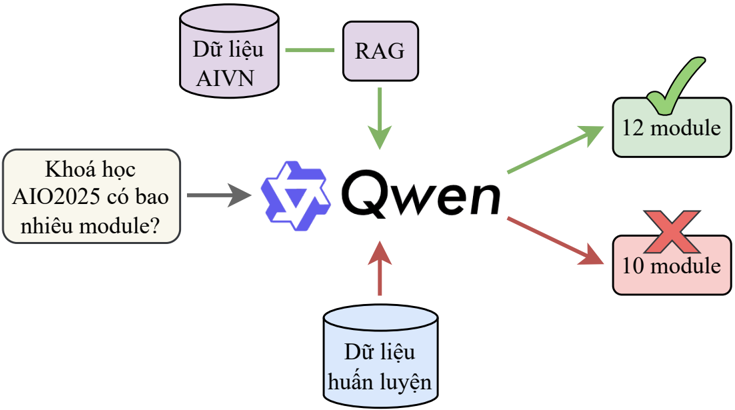
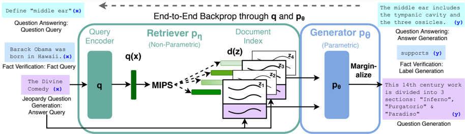

# Introduction to RAG and Theoretical Foundations

The explosion of Large Language Models (LLMs) like ChatGPT, Gemini, Claude, or Llama has reshaped the NLP field. However, despite their impressive generalization and reasoning capabilities, these models still face inherent limitations: restricted knowledge at the time of training, hallucinations when encountering questions outside their knowledge domain, and especially a lack of knowledge about private enterprise data.

To address this issue, Retrieval Augmented Generation (RAG) was created. RAG allows LLMs to access external data sources without the need for expensive fine-tuning or retraining. To introduce RAG, this article delves into its architecture and implementation, including:

1.  Deep analysis of RAG concepts, architecture, and basic pipeline.
2.  Introduction to the LangChain framework, a powerful tool for LLM applications.
3.  Building a QA System on academic PDF documents.

Figure 1: Illustration of LLM with (green line) and without RAG (red line).

| Glossary | Glossary |
| :--- | :--- |
| Term | Description |
| Hallucination | The phenomenon where the model generates false, fabricated, or non-existent information but with a confident tone. |
| Knowledge Cutoff | The time limit of training data, making the model unaware of events occurring afterwards. |
| Fine-tuning | The process of further training a pre-trained model on a specialized dataset to update weights. |
| In-Context Learning | The ability of an LLM to learn and perform tasks based on context or examples provided in the prompt without parameter updates. |
| Vector Embeddings | Representation of data (text, image) as real-number vectors in n-dimensional space. |
| Semantic Search | Search based on meaning similarity rather than just keyword matching. |
| Chunking | The technique of splitting long text into short segments to optimize encoding and fit Context Window limits. |
| Context Window | The maximum number of tokens (text units) that an LLM can receive and process in a single prompt. |
| Grounding | The technique of 'anchoring' the model's answer to provided real-world data to ensure authenticity. |

# Theoretical Foundations of RAG

## Origins

The concept of RAG was first officially proposed in the scientific paper **'Retrieval-Augmented Generation for Knowledge-Intensive NLP Tasks'** by Patrick Lewis and colleagues at Facebook AI Research (FAIR) in 2020[^1].

*Figure 2: RAG architecture overview in Patrick Lewis's original paper (2020).*

In this work, the authors defined RAG as a hybrid probabilistic model combining two memory types to overcome the drawbacks of traditional Pre-trained Seq2Seq models:

- **Parametric Memory**: Implicit knowledge stored in the weights of a sequence generation model (Pre-trained Seq2Seq Transformer). Specifically in the paper, the authors used the BART (Bidirectional and Auto-Regressive Transformers) model as the Generator.
- **Non-Parametric Memory**: Explicit external knowledge, specifically a dense vector index containing Wikipedia text segments. This component is accessed via a Neural Retriever based on the Dense Passage Retriever architecture.

The mechanism of the original RAG allows the Generator (BART) to use input combined with latent documents found by the Retriever to generate text. A key feature is that the entire architecture is fine-tuned end-to-end, enabling weight updates for both the Query Encoder and Generator to optimize the target task.

[^1]: See details at: https://arxiv.org/abs/2005.11401

## The Shift to In-Context RAG

Although the term RAG remains, the implementation mindset has fundamentally changed with the development of LLMs:

- **Original RAG (2020)**: An approach based on fine-tuning. As mentioned above, the original model required simultaneous training of both the retriever and the text generation model so they could learn to coordinate. Model weights changed during this process.
- **Modern RAG (Current)**: An approach based on In-Context Learning. With the explosion of massive LLMs capable of understanding broad contexts, modern RAG typically refers to a **'Retrieve and Prompt'** process.

In the modern model, we typically keep the LLM weights fixed and focus only on optimizing data retrieval, then feeding this data into the input (Prompt) for the model to process. This approach is flexible, low-cost, and easily applicable to private data without complex training procedures.

