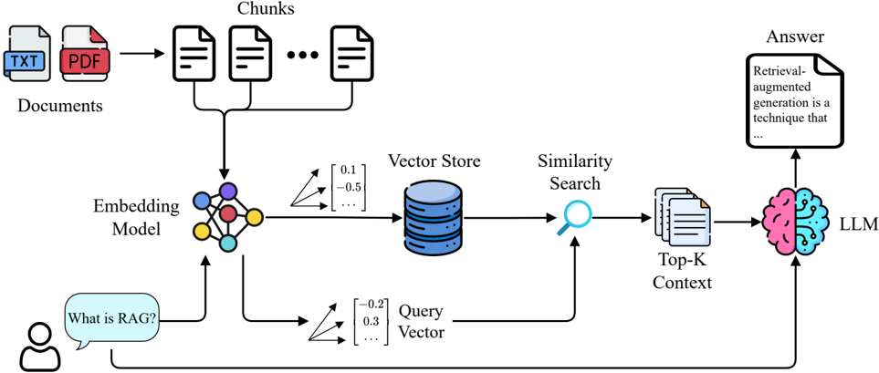
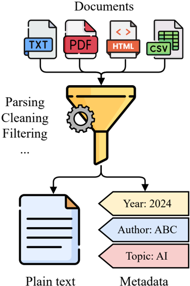
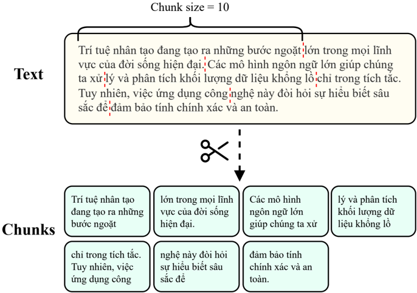
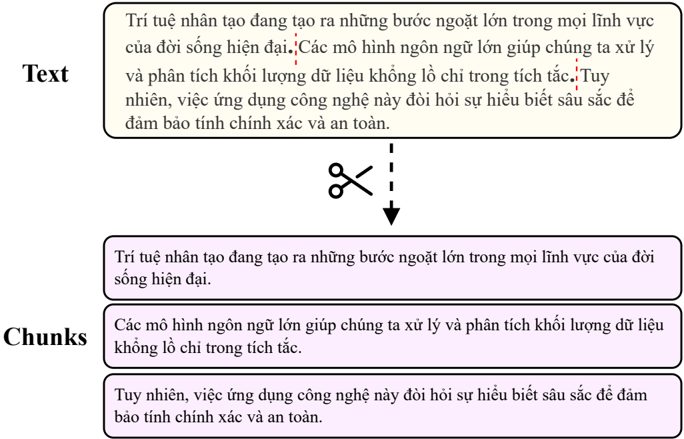
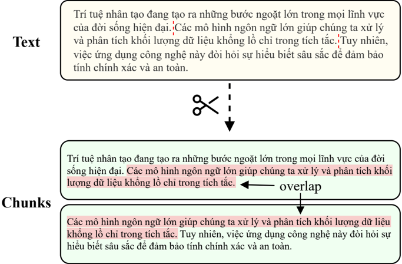
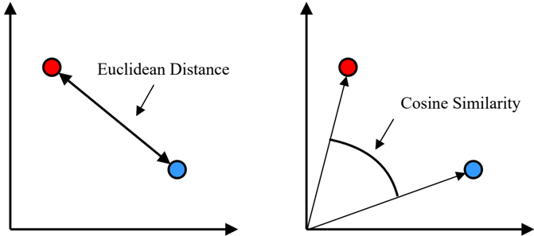
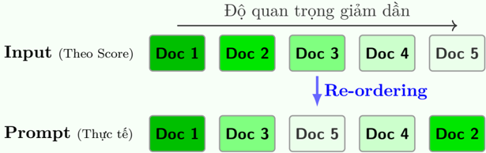

# Modern RAG Architecture
A standard RAG system today is typically modeled into a 3-phase process: Indexing, Retrieval, and Generation.



*Figure 3: Basic RAG workflow diagram.*

## Phase 1: Indexing

This phase is similar to the ETL (Extract-Transform-Load) process in data engineering. The goal of this phase is to convert raw data from various formats into a unified format so the system can search it.

This process includes steps from basic to advanced as follows:

### 1. Document Loading

Start by collecting input data sources, which can be internal enterprise data or data scraped from the internet.

- Extract content: The system needs to be able to handle diverse file types to strip complex display formats like fonts, colors, layouts, and keep the most important part: plain text.
- Collect metadata: In real-world applications, just extracting text content is not enough. An optimal RAG system needs to extract contextual information accompanying documents, called metadata, e.g., topic, page number, publication date, author, etc.

The role of metadata is extremely important to support Pre-filtering. For example, if a user asks about '2024 Revenue', the system will use metadata to filter strictly documents in 2024 instead of searching the entire dataset.



*Figure 4: Illustration of text extraction from data sources.*

### 2. Text Splitting (Chunking)

This is the step of splitting long documents into smaller segments called 'chunks'.

- Why Chunking?
  - (a) Context Window Limit: LLM and Embedding models have limits on input tokens. It is not possible to feed the entire content into the model at once.
  - (b) Search Accuracy: A vector of a short paragraph focusing on a specific idea will represent semantics better than an average vector of an entire page containing mixed topics.

- Fixed-size Chunking: Split text based on a fixed character or token count (e.g., cut every 500 characters). This method is simple but easily loses semantics if the cut point falls in the middle of a sentence or an uninterrupted idea.


*Figure 5: Illustration of Fixed-size Chunking with Chunk size = 10.*

- Recursive Chunking: This is the most common method today. The system will try to cut based on the natural structure of the text in priority order: paragraph breaks (`\n\n`) → line breaks (`\n`) → punctuation → spaces. This helps preserve sentence and paragraph structure.
- Chunk Overlap: To ensure semantics are not lost at the cut point between two adjacent chunks, we set the `chunk_overlap` parameter (usually 10-20% of the chunk length).


*Figure 6: Illustration of Recursive Chunking by punctuation.*

Example: Chunk 1 ends at word 100, then Chunk 2 will start at word 80. This intersection acts as a context 'bridge'.


*Figure 7: Illustration of Chunk Overlap concept.*

### 3. Advanced Indexing Strategies

In basic RAG, the text segment used for search and the text segment fed to the LLM are the same. However, this can create a conflict: small chunks are good for search, large chunks are good for LLM due to having more context. To address this, we have expansion strategies:

#### · Parent-Child Indexing (Small-to-Big):

- Split text into large blocks, e.g., 1000 tokens, called Parent chunks to contain full context.
- Split Parent chunks into smaller blocks, e.g., 200 tokens, called Child chunks.
- Mechanism: The system will index and search on Child chunks for high accuracy, but when returning results to LLM, the system will retrieve the corresponding Parent chunk.

- Summary Indexing: Use LLM to summarize the original chunk. We will index this summary version with more condensed meaning, but return the detailed original text when needed.

### 4. Embedding

- Use an Embedding model to convert text chunks into dense vectors (numerical vectors) in a multi-dimensional space.
- Accordingly, text segments with similar semantic content will have vectors located close to each other in this space.

### 5. Vector Store

- Store vectors along with IDs and corresponding metadata into a specialized vector database to serve retrieval in the later phase.

## Phase 2: Retrieval
This is the component that determines the success or failure of the RAG system. If this step extracts wrong or missing information, the LLM will not have enough data to answer. This process is not just simply vector search but also includes the following optimization techniques:

### 1. Query Processing

- In this step, the system receives the question from the user and passes it through the Embedding model to create the query vector q.
- In reality, user questions are often short, lacking context, or may have multiple meanings. To overcome this, we can apply:
  - Multi-Query: Use LLM to generate 3-5 different variations of the original question, then search all and combine results. This helps increase the ability to find relevant documents without depending on the user's single phrasing.

:::info
**Example:**

Input (User): 'db connection error' (Short question, lacking specific context)

**LLM Generated Queries:**
- (a) 'How to fix connection timeout error when connecting to database.'
- (b) 'Handle Access Denied error for root user in MySQL/PostgreSQL.'
- (c) 'Guide to check firewall blocking port 5432 or 3306.'

→ The system will search for all 3 issues (Timeout, Permission, Network) to ensure no relevant technical documents are missed.
:::

  - HyDE (Hypothetical Document Embeddings): Ask LLM to write a hypothetical answer to the question, then use the vector embedding of this hypothetical answer to search. This helps bridge the semantic gap between 'question' and 'document containing answer'.


:::info
**Example:**

Input (User): 'Laptop policy outside'

Hypothetical Document (LLM assumption): 'According to information security policy, employees wanting to take company assets (laptop, tablet) out of the office need to fill out the 'Device Registration' form on the system and must be approved by the Department Head...'

→ The vector of this hypothetical paragraph will match well with the 'Employee Handbook' or 'Security Procedure' documents in the database, much better than the original question.
:::

### 2. Similarity Search

- Dense Retrieval: The system calculates similarity between query vector q and document vectors d in the database.
  - Metric: Use Cosine Similarity or Euclidean Distance.
  - Algorithm: To ensure speed when data is large, instead of matching pairs one by one (often called Brute-force), we use ANN (Approximate Nearest Neighbor) algorithms like HNSW to find approximate nearest neighbors with low latency.
- Issue: Vector search is very good semantically but weak on exact keywords. Example: vectors of 'iPhone 14' and 'iPhone 15' are very close semantically, but the user needs exact information about version 15.


*Figure 8: Illustration of two common similarity metrics.*

### 3. Hybrid Search

This is a standard extension technique to overcome the above drawback.

- Mechanism: Combine results from two parallel search streams:
  - Dense Retrieval (Vector Search): Search based on semantic similarity in vector space. This method excels at finding content with equivalent meaning (e.g., 'car price' ↔ 'cost to buy automobile').
  - Sparse Retrieval (Keyword Search): Use traditional statistical algorithms like BM25 or TF-IDF.
- → Explanation: These algorithms work by counting the exact frequency of keyword appearance. It is extremely important for catching proper names, keywords, or technical terms that Vector Search often misses.
- Reciprocal Rank Fusion (RRF): A post-processing algorithm used to merge and re-rank results from the two streams above.

> **How RRF Algorithm Works**
>
> Problem: Scores of Vector Search and BM25 have completely different scales, direct addition would not be reasonable.
>
> Solution: RRF ignores raw scores and normalizes based on rank.
>
> {/* formula-not-decoded */}
>
> - Mechanism: Uses the inverse of rank ( r_i ). Rank 1 (small denominator) will give a very large score, Rank 100 (large denominator) will give a very small score.
> - Constant k: Usually 60, helps smooth scores, preventing Top 1 documents from dominating too absolutely compared to Top 2, Top 3.
> - Result: Documents ranking similarly in both lists usually have a higher total score than a document ranking first in one list but missing from the other.

### 4. Re-ranking

After obtaining a set of candidates (e.g., Top 50 documents) from the previous step, their order might not be completely accurate because vectors are just a compressed form of information.

- Cross-Encoder: Uses a specialized Deep Learning model to re-score the relevance between the question and each document in the initial candidate set.
- Why Cross-Encoder?
  - Bi-Encoder (Used in Indexing/Retrieval step): Encodes question and document into 2 separate vectors independently. Advantage is extremely fast, but disadvantage is losing complex grammatical and semantic relationships between question and text.
  - Cross-Encoder (Used in this Re-ranking step): Feeds both question and text into the model at the same time (like a human reading in parallel). It can recognize negation nuances, complex cause-effect relationships. More accurate but much slower.
- 'Funnel' Strategy: Retrieve Many (Get 50 documents fast using Bi-Encoder) → Re-rank Few (Get 5 best documents using Cross-Encoder) → Feed to LLM. This method balances speed and accuracy.

:::info
**Example:**

Query (User): 'Why didn't I receive email notification?'

1. Result from Vector Search (Bi-Encoder): (Found based on general similarity in topic 'email' and 'notification')

A. Rank 1: 'Email signature setup guide.' (Wrong: same topic but wrong intent)

- B. Rank 2: 'Company email usage culture policy.' (Wrong)

- C. Rank 3: 'Fixing spam email issue.' (Right, but ranked low)

2. After passing Cross-Encoder (Re-ranking): (Model understands relationship 'didn't receive' → 'error/spam')
- A. Rank 1: 'Fixing spam email issue.' ↑ (Pushed to top)
- B. Rank 2: 'Email signature setup guide.'
- C. Rank 3: 'Company email usage culture policy.'
:::

## Phase 3: Generation

After Retrieval returns a list of relevant documents, the system moves to the text generation phase. This is when the LLM synthesizes information to answer the user. This process is not simply feeding data in, but requires subtle context processing strategies.

### 1. Context Preparation

- Context Stuffing: This is the simplest method. The system merges all text of found documents (Top-K) into one long paragraph, then appends to the Prompt.
- Problem:
  - Cost & Latency: The longer the input, the slower the LLM processes and the more tokens it consumes.
  - Information Noise: Too much irrelevant information can cause the LLM to 'lose' the topic.

#### Context Selection & Compression:

- Context Reordering: Based on the 'Lost in the Middle' phenomenon: LLMs often pay best attention to information at the beginning and end of the prompt, but often ignore information in the middle.

> **Reordering Tactic: U-shape Optimization**
>
> Instead of feeding documents in descending order of relevance, we rearrange to put the most important documents at both ends and less important documents in the middle:
>
> 
> *Reordering Tactic*
>
> → Result: Important documents (dark color) surround less important documents (light color), maximizing LLM concentration.

- Context Compression: Use a small LLM or NLP algorithm to summarize main ideas before feeding into the main LLM.


*Context Compression*

:::info
**Example:**

Query: 'How much is the cancellation fee?'

1. Raw Context (300 tokens): '...According to clause 7.2 of the service contract signed on... (lengthy legal text)... in case the customer wants to terminate the contract before the deadline, must notify in writing 30 days in advance and bear a penalty fee equivalent to 02 months of usage charges...'
2. Compressed Context (20 tokens): 'Clause 7.2: Cancellation fee is 02 months of usage charges.'
3. → The main LLM only needs to receive this brief segment, helping answer faster and minimize hallucination.
:::

### 2. Prompt Engineering

The quality of the answer depends heavily on how we command the model. A good context but a bad prompt can still lead to a wrong answer.

- Zero-shot Prompting: Use a fixed template to guide the model to answer directly based on context without sample examples.

#### RAG Prompt Template (Standard)

```text
System: You are an assistant for question-answering tasks. Use the following pieces of context to answer the question. If you don't know the answer, just say that you don't know.

Context:

{context}

Question:

{question}

Answer:
```

- Few-shot Learning: Provide 1-2 sample examples (including standard Context - Question - Answer triplet) into the prompt so the LLM learns the answering style and desired format.


*Few-shot Learning Illustration*

> **Example**
>
> Instruction: Answer briefly, provide numbers only. Example 1: Context: 'Revenue in 2022 was 10 billion, in 2023 increased to 12 billion.' Question: How much is 2023 revenue? Answer: 12 billion. Actual Task: Context: `{real_context}` Question: `{user_question}` Answer:

- Chain-of-Thought (CoT): Ask the model to think step by step ( Let's think step by step ) based on facts in the context before reaching the final conclusion.

> **Why CoT?**
>
> For complex questions requiring logic, if forcing LLM to answer immediately, it is very prone to guessing.
>
> With CoT: LLM self-generates a process: 'Step 1: Find price of package A... Step 2: Find price of package B... Step 3: Compare...' → Result is significantly more accurate[^2].

[^2]: See details at: https://arxiv.org/abs/2201.11903

### 3. Generation & Attribution

- Basic: LLM generates answers in normal text form. The main goal is fluency and grammar correctness.
- Citation: One of the biggest competitive advantages of RAG over traditional chatbots is the ability to transparently cite sources.
  - Mechanism: In the prompt, we ask LLM: 'All information provided must be accompanied by the ID of the source document'.
  - Benefit: Helps users easily verify, build trust, and minimize risks when the model fabricates information.

> **Illustration of output with source citation**
>
> User Question: 'How is overtime calculated?'
>
> RAG Response: 'According to company regulations, employees working overtime on weekdays are entitled to 150% of basic salary [Employee Handbook, P.12] . For holidays, the rate is 300% salary [Labor Law 2019, Article 98] . '
>
> → Users can click on [..] to open the original document directly for comparison.

# II.3. Extension: Component Role Analysis

To accurately evaluate the importance of each module in the RAG architecture, let's analyze assumptions based on the question: 'How would the system work if a specific component is removed?'.

## Scenario 1: Remove Embedding Model

Role of Embedding Model: Convert text to vector to support semantic query.

- Mechanism: When there is no Embedding Model, the system cannot encode text into vectors and loses the ability to compare semantic similarity. Forced to revert to lexical retrieval methods like BM25, TF-IDF, or Exact Match.
- Impact: Drastically reduces ability to capture context, synonyms, and equivalent phrasing.
- Example: User searches 'car price'. Document only containing 'cost to buy automobile' might be ignored because it doesn't match keywords directly.
- Consequence: System becomes **Lexical Retrieval-driven RAG**: Still has LLM to answer, but semantic query quality drops significantly and easily misses information.

## Scenario 2: Remove Vector Store/ANN Index

Role of Vector Store/ANN Index: Store vectors, manage metadata, and support fast search at scale.

- Mechanism: System can still create vectors, but without ANN index layer, search usually has to compare with many vectors in a linear fashion (Brute-force).
- Impact: Query latency increases sharply when data is large ( O ( N )). Acceptable with a few hundred documents, but with hundreds of thousands to millions of vectors, the system easily becomes slow, resource-intensive, and hard to meet real-time requirements.
- Additionally, filtering by metadata, updating/inserting/deleting data, and operation also become difficult without a suitable storage layer.
- Consequence: System becomes **Unscalable Prototype**, can run demo at small scale, but hard to scale and operate stably in real-world environment.

## Scenario 3: Remove LLM (Large Language Model)

Role of LLM: Brain to synthesize information, reason, and generate answers based on query context.

- Mechanism: System can still query relevant documents well thanks to Embedding Model and Vector Store, but the process stops at Retrieval step. Returned output is just a list of text segments (Top-K) with scores/metadata.
- Impact: Lose ability to synthesize, interpret, and answer directly in conversational form (Question Answering).

Example: Instead of answering 'Revenue is 10 billion', system only returns excerpts from report, and user has to read to draw conclusion.

- Consequence: System becomes **Semantic Search / Retrieval System**, strong in semantic query, but without Generation component, so it is not yet a chatbot or complete RAG system.

Table 1: Summary of RAG system changes by scenario.

| Missing Component | System Becomes | Core Limitation |
| :--- | :--- | :--- |
| Embedding Model | Lexical Retrieval-driven RAG | Drastic reduction in semantic query, hard to catch synonyms, and easy to miss information. |
| Vector Store/ANN Index | Unscalable Prototype | Latency increases sharply with large data, hard to operate system. |
| LLM | Semantic Search / Retrieval System | Cannot synthesize, interpret, and answer conversationally; user must read and draw conclusions from excerpts. |