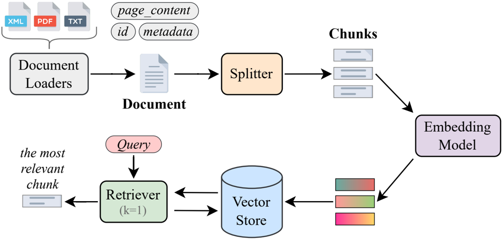

# LangChain Framework and Core Components

# Introduction to LangChain

LangChain is a powerful open-source framework designed to simplify the development of applications using Large Language Models (LLMs). generally, LangChain acts as a link connecting data, logic processing, and models together.

In the Retrieval Augmented Generation (RAG) problem, LangChain solves the core issue of disconnection between data sources and LLM capabilities. This library supports the entire lifecycle of RAG applications without requiring programmers to build complex manual connections themselves.

For more details about the LangChain library, you can explore at: [LangChain](https://docs.langchain.com/oss/python/langchain/overview)


# Core Components

To build a RAG application with LangChain, we need to understand the main components below:


*Figure 9: Overview of main RAG components in LangChain.*

## 1. Documents and Document Loaders

In LangChain, the basic unit to represent information is the `Document` object. Before building RAG, data from various sources needs to be converted to this format.

`Document` Structure: LangChain implements the `Document` class to represent a text unit and accompanying metadata. A `Document` object includes three main attributes:

- `page_content`: String containing text content.
- `metadata`: A dictionary containing arbitrary additional info, e.g., document source, page number, relationship with other docs.
- `id`: String identifier for the document.

Loading Documents: LangChain provides a Document Loaders ecosystem integrating with hundreds of data sources like PDF, CSV, HTML. For example, using `PyPDFLoader` to load a PDF document into a `Document`.

```python
from langchain_community.document_loaders import PyPDFLoader

file_path = "../AI.pdf"
loader = PyPDFLoader(file_path)
doc = loader.load()
```

Splitting: An original document page is often too long or contains mixed information. Splitting text increases accuracy when retrieving. Text Splitters tools are used to divide documents into small segments, called 'chunks'. A common method is `RecursiveCharacterTextSplitter`, with functions:

- Recursively split based on separators like newlines, spaces, to preserve semantics.
- Keep a portion of overlapping characters between adjacent segments to ensure uninterrupted context.

```python
from langchain_text_splitters import RecursiveCharacterTextSplitter

text_splitter = RecursiveCharacterTextSplitter(
    chunk_size=1000,  # Size of each chunk
    chunk_overlap=200,  # Keep 200 tokens of adjacent segment
)
all_splits = text_splitter.split_documents(doc)
```

## 2. Embeddings

Vector Search is a common method for storing and searching unstructured data.

Operating Principle: An Embedding model converts a text into a real-number vector representing that text. Numerical representation allows:

- Texts with similar meanings will have vectors close in geometric space.
- Metrics like cosine similarity are used to determine similarity between texts via calculation on their corresponding vectors.

LangChain supports standard interface for many embedding model providers like OpenAI, Google, HuggingFace, ...

```python
from langchain_openai import OpenAIEmbeddings

embeddings = OpenAIEmbeddings(model="text-embedding-3-large")

# Create vector for a text segment
vector_1 = embeddings.embed_query(all_splits[0].page_content)
print(len(vector_1))
# Result: 1536 (vector dimension)
```

## 3. Vector Stores

VectorStore in LangChain is responsible for storing `Document` objects and corresponding vectors, while providing methods to query them. Includes two main functions:

- Indexing: Add text to storage via `add_documents` method.
- Querying: Search text based on similarity between two vectors with `similarity_search` method.

LangChain integrates with many types of vector stores: from in-memory like `FAISS` and `InMemoryVectorStore`, to specialized databases with `Chroma`, `Pinecone`, `Postgres`.

```python
from langchain_core.vectorstores import InMemoryVectorStore

vector_store = InMemoryVectorStore(embeddings)
ids = vector_store.add_documents(documents=all_splits)
results = vector_store.similarity_search(
    "How many distribution centers does Nike have in the US?"
)
```

## 4. Retrievers

While VectorStore is for storage, Retriever is used to query data. A special feature is that Retrievers in LangChain are `Runnable`, allowing them to connect easily into processing chains.

### VectorStoreRetriever

The simplest way to create a Retriever is from a VectorStore via `.as_retriever()`. You can add search parameters like `search_kwargs` and search type `search_type`:

- `similarity`: Default similarity search.
- `mmr` (Maximum Marginal Relevance): Balances between similarity and diversity of results.
- `similarity_score_threshold`: Filter out results with similarity score lower than specified threshold.

```python
# Create Retriever from Vector Store
retriever = vector_store.as_retriever(
    search_type="similarity",
    search_kwargs={"k": 1}  # Only take 1 best result
)

# Execute search (Batch)
retriever.batch([
    "How many distribution centers does Nike have in the US?",
    "When was Nike founded?",
    "What is the company's mission?",
])
```
